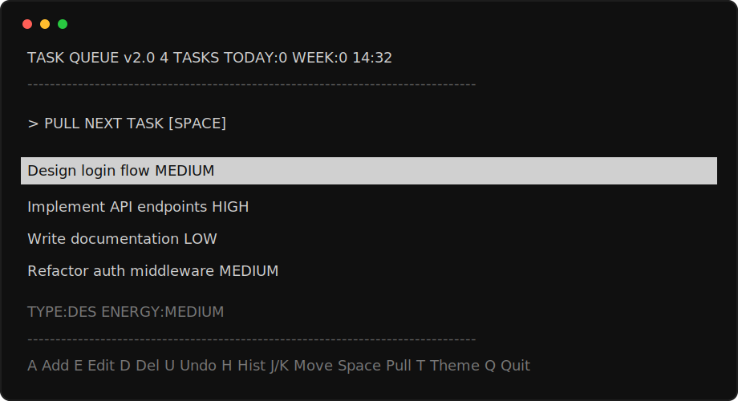

# task-queue-tui

A minimal terminal task queue for doing one task at a time.

```bash
npm install -g task-queue-tui
tq
```

## Preview



## Why

Most task apps turn into another place to manage work. `tq` keeps the loop small:

1. Pull the next task.
2. Focus on it.
3. Finish it or return it.
4. Move on.

No account. No cloud. No project-management sprawl. Just a local queue in your terminal.

## Usage

```bash
tq                              # grey theme
tq --theme=amber                # warm retro theme
tq --theme=slate                # cool blue-grey theme
tq --types="dev,review,admin"   # custom task types
tq --help                       # show commands
tq --version                    # show installed version
```

Tasks are stored as plain JSON in `~/.taskqueue/tasks.json`.

## Commands

### Queue

| Key | Action |
|-----|--------|
| `Up` / `Down` or `j` / `k` | Navigate tasks |
| `Space` / `Enter` | Pull next task into focus mode |
| `a` | Add a task |
| `e` | Rename or edit selected task |
| `d` | Delete selected task |
| `u` | Undo last delete |
| `h` | View completed task history |
| `J` / `K` | Reorder selected task |
| `T` | Cycle theme |
| `q` | Quit |

### Focus

| Key | Action |
|-----|--------|
| `f` | Finish task |
| `r` | Return task to queue |
| `Space` / `Enter` | Swap with first queued task |
| `q` / `Esc` | Return to queue |

### Edit

| Key | Action |
|-----|--------|
| Type | Rename task |
| `Tab` | Move between name, energy, and type |
| `Left` / `Right` | Change energy or type |
| `Enter` | Save |
| `Esc` | Cancel |

### History

| Key | Action |
|-----|--------|
| `h` | Open or close completed history |
| `Up` / `Down` or `j` / `k` | Browse completed tasks |
| `q` / `Esc` | Return to queue |

## Install From Source

```bash
git clone https://github.com/engine-research-lab/task-queue-tui.git
cd task-queue-tui
npm install
npm link
tq
```

Requires Node 20+ and a terminal that supports 24-bit color.

## Data

To reset your queue:

```bash
rm ~/.taskqueue/tasks.json
```

Example task file:

```json
[
  {
    "id": "abc123",
    "name": "Design login flow",
    "energy_level": "medium",
    "task_type": "design",
    "status": "queued",
    "position": 0,
    "created_at": "2026-05-24T03:01:41.771Z",
    "completed_at": null
  }
]
```

## Docs

- [Roadmap](docs/roadmap.md)

## License

AGPL-3.0-or-later
